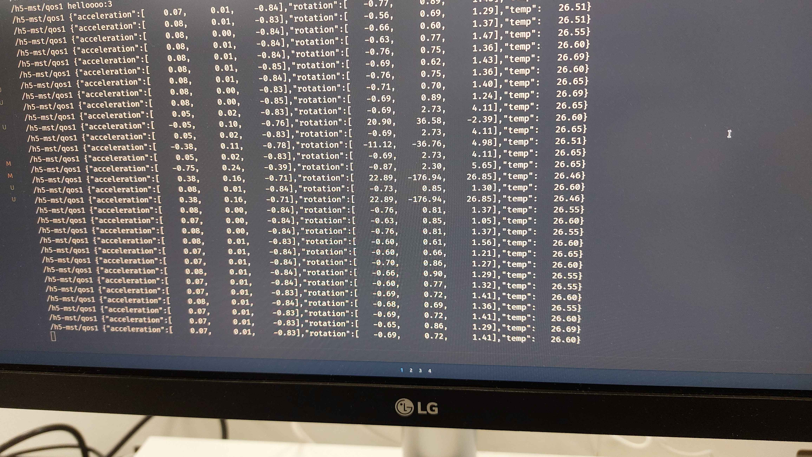
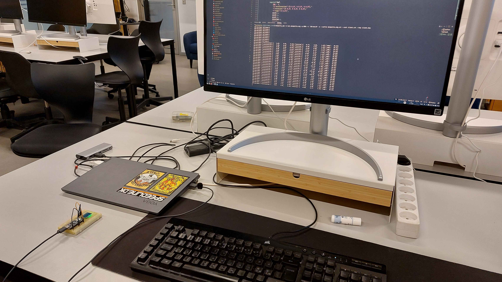
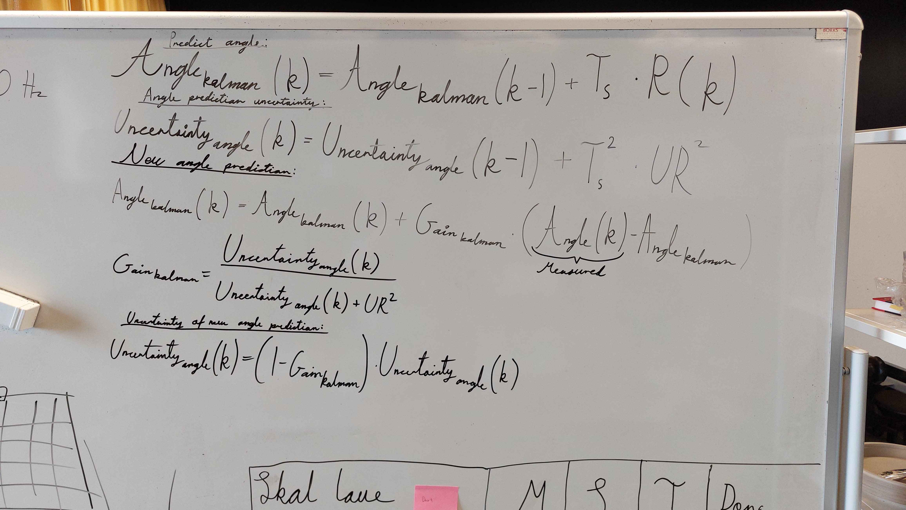
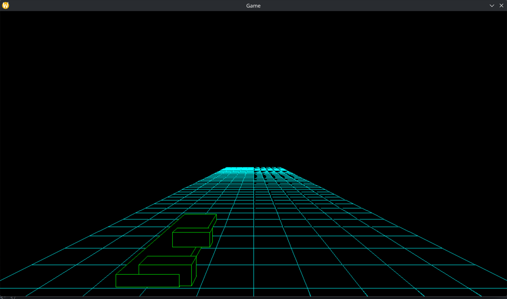
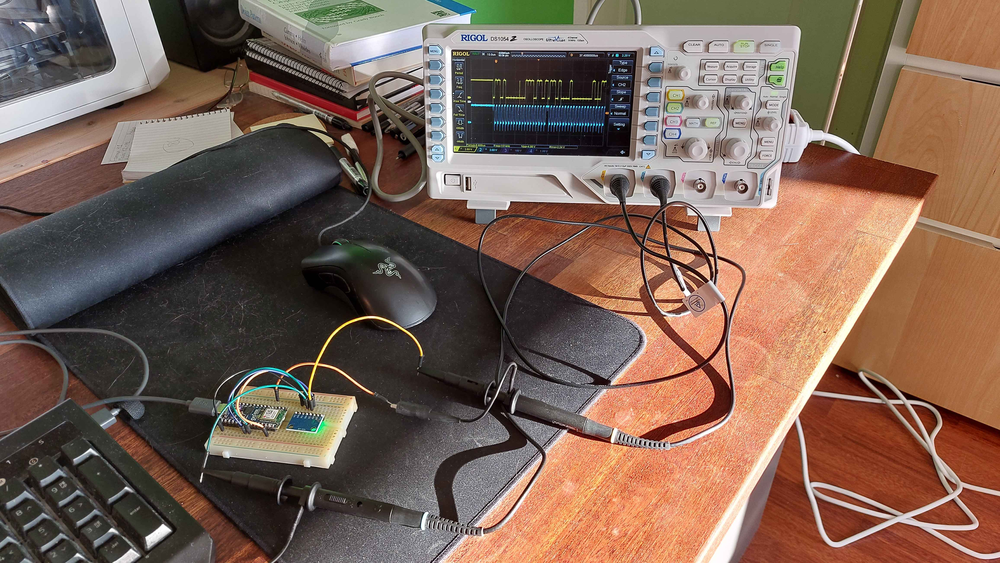
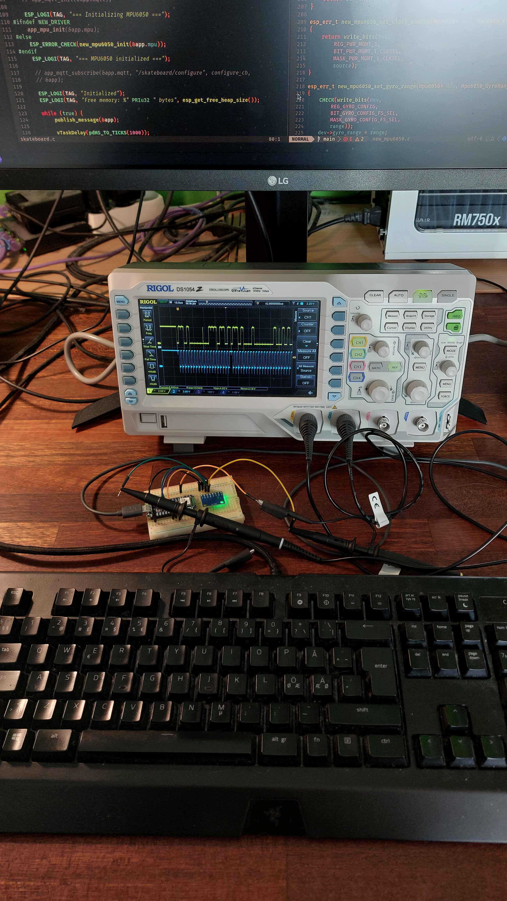
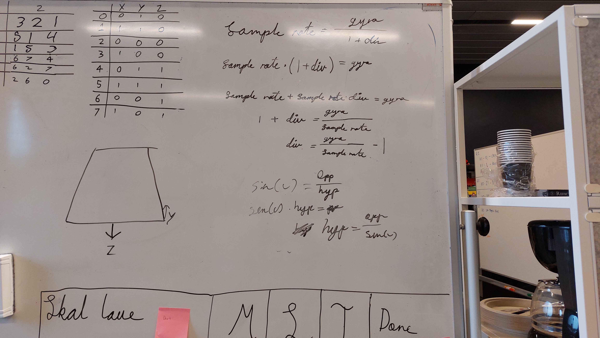
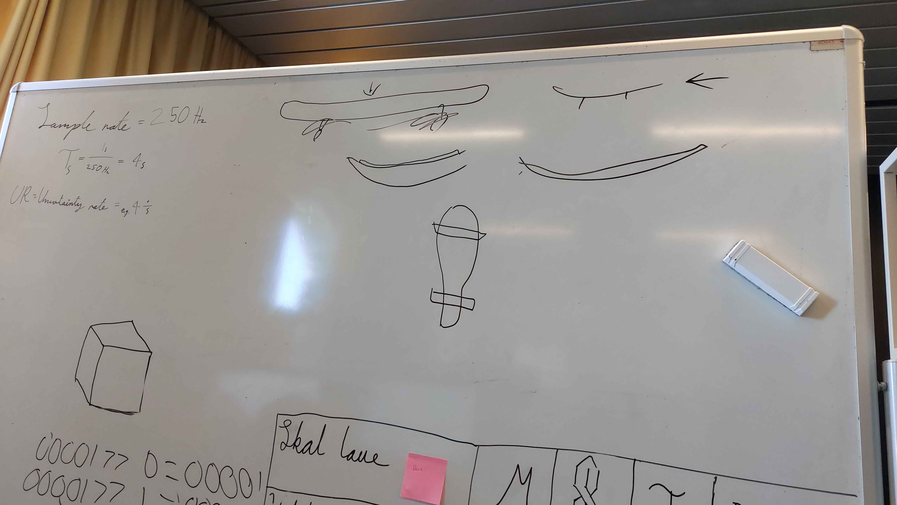
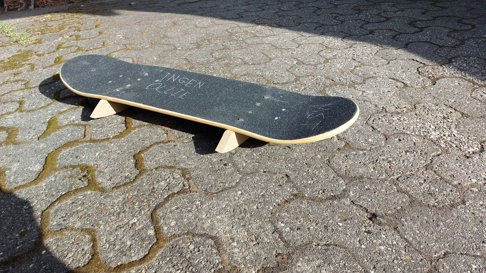

# Processrapport

M. Kongsted, S. F. Jakobsen &lt;sfja2004@gmail.com&gt;, T. P. Hollebeek

## Indledning

Som forberedelse til forløbet diskuterede vi diverse ambitioner og forventninger. Vores mål var at opnå en forventningsafstemning, for hvor bredt omfang projektet skulle havde. I gruppen er vi i den situation, at det faglige niveau blandt gruppmedlemmerne variere betydeligt. Dette kræver en større indsats for koordinering og forventningsafstemning, så den ene ende af gruppen får mulighed for faglig udfoldelse, samtidig med at den anden ende kan være med. Vi valgte aktivt, at forebygge eventuelle konflikter, ved at tage nogle af disse diskussioner før forløbet.

## 20-3-2026

### Idegenerering

Vi påbegyndte forløbet med en brainstorm over, hvilket projekt vi ville arbejde med. Vi havde udfordringer med at komme på ideer, så vi gik metodisk til værks. Vores prioritet i starten var at skrive så mange ideer på et whiteboard som muligt. Vores metode gik ud på, at vi tænkte på en type sensor, og så tænkte vi på projekter, hvor man kunne inddrage sensoren.

Vi fik skrevet en håndful ideer på tavlen. Disse ideer blev omdiskuteret internt i gruppen. En af gruppemedlemmerne var ikke tilstede, men fik en mundtlig gennemgang af de brainstormede ideer.

Dagen efter var hele gruppen samlet. Her blev ideerne diskuteret og evalueret igen. Med baggrund i erfaring og estimater, blev nogle ideer valgt fra, og andre blev uddybet.

Vi endte ud i 2 ideer. Den ene en dart-tracker, som via. kameraer skulle kunne tracke score på en dartplade. Den anden var et Slope-agtigt spil, hvor man styrer med et skateboard. Den første ide blev valgt fra efter en faglig vurdering om, at projektet ikke var kompatibel med vores forventningsafstemning. Den anden ide var derved blevet valgt.

Med det samme efter at havde valgt ideen med Slope-spil og skateboard, gik vi i gang med at uddybe ideen og tænke på en mulig implementering. Vi vidste, ud fra kravene til projektet, at vi skulle inddrage forskellige dele i vores løsning. Dette galdt eksempelvis en sensor og en IoT-device. Vi gik i gang med at lave research på mulig hardware. Vi valgte at bruge et accelerometer/gyroskop-komponent til vores skateboard. Af en betragtning af, hvilke lignende projekter vi kunne finde på internettet, vores erfaring og hvad vi kunne tænke os, at lære om, valgte vi en ESP32 SoC og en MPU6050 sensormodul.

Vi bestilte hardware'en med det samme. Ideen var, at jo hurtigere vi fik mulighed for at arbejde med hardware'en, desto hurtigere ville vi finde ud af, om det passede vores behov. I mellemtiden kiggede vi efter hardware med lignende funktionalitet. Skolen havde et Arduino OPLA kit tilrådighed. Her kunne vi lave et eksperiment med OPLA-hattens accelerometer/gyroskob og den Arduino MKR 1010 WiFi, som følger med. Med dette setup og Arduino's manual, lavede vi et program, som aflæste målingsværdierne og plottede det på en visuel graf.

 MPU'ens accelerations- og vinkelaccelerationsmålinger plottet over tid på en graf.

## 23-3-2026

### ESP32 firmware

Efter weekenden kom vores hardware. Omgående gik vi i gang med at lave et setup til at påvise, at hardware'en passede til vores behov. I første omgang krævede det, at der blev lodet pins på MPU6050'en. En af gruppemedlemmerne har erfaring med lodning, og lodede dem på. ESP32'eren og MPU'en blev herefter monteret på et breadboard.

 **Figur 1:** Lodestation med MPU6050 understøttet af en blyant.

 **Figur 2:** MPU6050 med pins lodet på.

Herfra forsøgte vi så hurtigt som muligt, at lave en firmware, hvor vi kunne aflæse MPU6050'erens målinger gennem I2C på ESP32-S3'eren, og sende det til host-computeren. Dette kom til at virke samme dag.

 **Figur 3:** MPU6050 måledata, sendt fra ESP32, vist på host-computer.

 **Figur 4:** Setup med breadboard og data på skærmen.

Vi kunne på nuværende tidspunkt bekræfte, at dette hardware-setup opfyldte de krav, som vi havde. Vi vurderede altså, at setup'et, som det var på breadboardet, var fyldesgørende. Dette var en af to store usikkerheder i projektet. Ved at have lagt denne usikkerhed bag os, kunne vi nu planlægge uden uvisheden af, om det overhovedet var muligt.

### Game

Vi oprettede et game projekt og tilføjede en CI-pipeline hertil. Ud fra en overenstemmelse kom vi frem til at bruge Rust til spillet. Denne beslutning blev taget primært på baggrund af vores tidligere erfaring, og at vi vurderede, at Rust ville integrere godt med vores valg af graphics library SDL.

I dette stadie var spil-applikationen et Rust-projekt med sdl3-pakken installeret, som kunne åbne et vindue. Den var herved klargjort til, at vi kunne implementere 3D-rendering og resten af spillet.

### Backend

Vi oprettede også et backendprojekt. Vi valgte at skrive dette projekt i C++. Dette valg blev taget af flere årsager, og andre alternative blev også taget i betragtning. Vi valgte C++ ud fra en vurdering af, at nem integration med MQTT og inhouse TCP-protokel ville kompensere for den øgede generelle sværhedsgrad. En anden grund var også, at vi i gruppen ønskede at udvikle vores egenskaber med C++. Et andet alternativ, der blev taget i betragtning, var Typescript. Vi har i gruppen mere erfaring med Typescript, så vi vurderede, at backend-delen ville blive nemmere at skrive, hvis vi valgte Typescript. Vi beholdte valget med C++, da vi gerne ville give en større indsats og lære mere.

Backenden var i dette stadie en C++-applikation, der skrev en besked i konsollen, når man kørte programmet. Desuden var der defineret en enkelt unittest. Indsatsen blev lagt i at opsætte et buildsystem, som vi også kunne bruge i vores CI-pipeline. Backend var herved klar til, at vi kunne implementere MQTT- og TCP-funktionalitet.

### Projekstyring

Vores overordnede strategi for projektstyring består af nogle hovedpunkter.
- **Punkt 1** er, at vi optimerer for forståelse og feedback. Vi prioriterer derfor, at arbejde med de svære dele af projektet, og derved bygge forståelse, en at estimere, hvor lang tid det vil tage, at lave de svære dele.
- **Punkt 2** er, at vi kun skal tage de beslutninger, som er nødvendige. Det vil eksempelvis sige, at vi ikke fastlåser os i, at skulle bruge en uge på en opgave, som med gode grunde både kunne tage 2 dage eller 2 uger. Vi lægger istedet tryk på, at være dynamiske. 
- **Punkt 3** er, at vi meget hyppigt danner overblik over processen og diskutere, hvilken retning vi bør have.

Disse punkter passer godt i vores tilfælde, dels på grund af gruppen og dels på grund af projektet. Projektet vi har valgt, har visse dele som er relativt komplicerede. Det giver en tidsmæssig usikkerhed, at inddrage systemer og teknikker, som man ikke har kompetencer i. Denne tidsmæssige usikkerhed gør det mindre brugbart at lave en udførlig plan tidligt i forløbet. Derudover er læringsprocessen sporadisk, og situationen kan derfor ændre sig uforudseeligt. Her giver det mening med dynamik i projektstyringen.

Som gruppe har vi også nogle faktorer, som øger nødvendigheden af dynamisk projektstyring. Nogle af gruppemedlemmerne inkonsistente i deres arbejdstid og -indsats. Dette kræver af projektstyringen, at det kan håndtere perioder med stor fremgang og perioder med lille fremgang. Ved hyppigt at danne overblik over projektet, er det nemmere at prioritere og estimere fra eller til i henhold til disse forhold.

### Overordnet estimering

Vi har bevidst ikke valgt, at lave en udførlig tidsplan. Istedet har vi udridset en udviklingsplan med mere fokus på tidsmæssig usikkerhed og prioritering end på tidsmæssig punktlighed.

- Lav setup med sensor og SoC-board, som opfylder vores behov. (Første uge)
- Lav fundament til 3D-spil. (Første uge)
- Lav backend-funktionalittet til kommunikation. (Første eller anden uge)
- Undersøg 3D-matematik og Kalman-filter. (Anden og tredje uge)
- Lav spil, som opfylder behov. (Anden eller tredje uge)
- Integrer system og færdiggør system (Fjerde uge)

I første omgang var prioriteten at få MPU-setup'et og 3D-renderingen til at virke. Disse opgaver var de største kilder til usikkerhed i projektet. Ved at prioritere, at lave dem hurtigst muligt, fik vi hurtigt et overblik over resten af projektet. Efter den første uge, havde vi fået begge på plads.

## 24-3-2026

### Hurtigt udviklet firmware

Vi arbejdede på at få sensordata sendt over MQTT fra ESP32'eren til host-computeren. Vi lavede en opsætning ud fra nogle eksempelprojekter, som kunne læse sensordata, oprette forbindelse til WiFi og sende sensordataen over MQTT til en message broker på host computer'en. Løsningen var af meget lav kvalitet, men prioriteten var, at få noget til at virke så hurtigt som muligt. Ideen med dette var, at så snart vi havde noget der virkede, kunne vi ud fra dette, arbejde os frem til en bedre forståelse. Efter at få en bedre forståelse, ville vi kunne omskrive koden, så vi fik en løsning i bedre kvalitet.

 **Figur 5:**  Gyro- og accelerometerdata vist på skærmen på host-computeren.

### 3D-rendering

Vi fortsatte arbejdet på spillet. Vi arbejde på at få implementeret 3D-rendering. I gruppen havde vi forskellige kilder, som beskrev hvordan man simpelt kunne implementere 3D-rendering. Udviklingen af 3D-rendering var ikke nemt. Det krævede meget arbejde, at forstå hvordan matematikken fungere, og hvordan vi kunne implementere det i vores kode. På samme tid havde det primære gruppemedlem på denne del af system ikke tilstrækkelige færdigheder med Rust. Herved var det en dobbeltudfordring at implementere. Vi vurderede, at det var bedst, hvis den øvrige guppe lod dette gruppemedlem arbejdet med det, selvfølgelig med støtte. Alternativet kunne her være, at de andre gruppemedlemmer lavede implementeringen, hvor vi ville ricikere, at det første gruppemedlem ikke kunne forstå eller arbejde med den implementerede løsning.

Vi fik implementeret en simpel 3D-projektion. Dog understøttede denne implementation kun, at punkterne var defineres direkte ud for kameraet. I vores spil, kommer vi til at rendere objekter fra siden, så dette var ikke tilstrækkeligt.

 **Figur 6:** Punkter på en terning renderet i 3D.

## 25-3-2026

Vi implementerede, så backenden kunne modtage data over MQTT. Dette blev gjort, ved at vi implementerede en MQTT-klient som kunne forbinde til en Mosquitto-instans, som vi hostede lokalt.

Vi fortsætte også på 3D-rendering uden meget fremgang.

## 26-3-2026

Udover oprydningsarbejde i backenden gik denne dag primært med arbejde på 3D-rendering. Ved at have bygget en bedre teoretisk forståelse, kunne vi gå mere metodisk til værks. Dette gjorde det muligt for os, at implementere en løsning som faktisk virkede.

 **Figur 7:** 3D-figur af en terning defineret visuelt og med vertex- og face-tabeller.

 **Figur 8:** Diagram af projektion med kamera og field of view.

 **Figur 9:** Tidlig revision af formlen til 3D-projektion.

## 27-3-2026

Vi valgte at oprette en planner board. Det er bevidst, at vi først har indført dette system nu. Før i dag, havde vi for store usikkerheder, til at kunne få værdi ud af planlægning. Efter at få 3D-rendering til at virke, har vi nu styr på de 2 store usikkerheder. Vi kan derfor begynde, at arbejde mere struktureret på resten af projektet. Vi vurderede, at det ville hjælpe os med at danne og opretholde overblik, hvis vi havde et estimat af, hvilke opgaver der var at lave, og hvem der var i gang med hvilke opgaver.

Vi valgte også bevidst, at gøre planlægningsværktøjet så simpel som muligt. Vi har erfaring fra tidligere projekter med at plænlægge på denne måde. Vi erfarede, at det virkede godt for os, og at det passede til vores dynamiske arbejdemåde.

 **Figur 10:** Vores simple planner board med sticky notes på et whiteboard.

## 30-3-2026 - 1-4-2026

I denne uge arbejdede på skateboard-driver'en. Vi arbejde på at få gyroskop- og accelerometerdataen konverteret, så vi kunnne bruge det i spillet. Vi fandt ud af en simpel løsning, hvor man måler retningen af tyngekraften med accelerometeret. Dette kunne man bruge til at måle rotationen om en bestemt akse på MPU605'eren.

Udover den simple løsning, brugte vi tid på at undersøge mere advancerede teknikker. Vi undersøgte Kalman-filtre for at se, om vi kunne anvende det med fordel i vores projekt. Vi konkluderede, at Kalman-filtre var for teknisk svære, end hvad vi kunne nå at lære. Vi kiggede i diverse literature, hvor stort set det hele af det, antog et fagligt grundlag, som vi ikke besidder.

 **Figur 11:** Eksempel på beregninger af Kalman-filter på en akse.

Vi arbejdede også videre på 3D-rendering og resten af spillet. Vi lavede en opsætning, så vi kunne rendere komplicerede 3D-figure bygget op af terninger. Som en del af dette arbejdede vi på, at tegne trekanterne (som figurene består af) i den rigtige rækkefølge. Dette er væsentligt, for at få figurene renderet korrekt. Koden til at lave rækkefølgen af trekanterne blev ikke perfekt, men vi fik en god forståelse for problemet. Vi fik også lavet en skateboard-model, som vi kunne bruge i spillet. Vi fik også implementeret, så jorden i spillet blev renderet fra starten af skærmen ud i horisonten. Derudover implementerede vi, så man kunne bevæge skateboardet sideværts med piletasterne.

Vi arbejdede også på vores server-setup. Vi bookede en Linux-server og satte den op med permissions, brugere og SSH. Vi lavede også en Docker Compose-opsætning med Mosquitto og vores backend. Vi fik derved lavet en deployment-opsætning, hvor vi kunne deploy med en enkelt kommando.A

Vi eksperimenterede med at lave en opsætning med Ansible. Dette var tiltænkt som deployment-automation-system, som først skulle køre parallelt med vores Github Actions CI setup, og muligvis erstatte det. Dog vurderede vi, at vi ikke ville give den indsats, det ville kræve.

 **Figur 12:** Spil med skateboard. På dette tidspunkt var skateboardmodellen meget simpel. Det ses også, projektionstrekanterne blev renderet i forkert rækkefølge.

## 2-4-2026 - 6-4-2026

På trods af at denne periode var plaget af weekend og helligdage, fortsatte visse gruppemedlemmer på arbejdet. Vi havde oplevet problemmer med driveren til MPU6050'eren. Vi valgte derfor, at undersøge den gamle driver og forsøge at skrive en ny.

Arbejdet gik i første omgang ud på at undersøge, hvordan kommunikationen mellem ESP32'eren og MPU'en virkede. Kommunikationen bruger I2C, og vi vidste fra tidligere arbejdsopgaver, at kommunikationen kunne undersøges med et oscilloskop.

Vi fandt produktbeskrivelsen og programmeringsmanualen til MPU6050. Med disse og den gamle driver som reference, skrev vi en ny driver. Vi opdagede, at det var ukompliceret at skrive driveren, efter vi fik et godt overblik over manualen. Vi brugte oscilloskopet og serial printing til debugging af driveren. Efter et par dages arbejde, fik vi driveren til at virke bedre end den gamle.

 **Figur 13:** Skateboard-enhedens kommunkation målt med oscilloskop.

 **Figur 14:** Skateboard-enhedens kommunkation målt med oscilloskop med driver-koden i baggrunden.

På samme tid valgte vi at genbesøge 3D-renderingen. Vi oprettede et parallelt Rust-projekt til spillet. Her implementerede vi 3D-rendering på baggrund af den erfaring, vi fik fra at implementere det i spillet. Vi fik implementeret, så vi kunne importere modeller fra Blender, og rendere dem korrekt med rotationer og belysning.

(indsæt billede af fancy editor 3d)

## 7-4-2026 - 10-4-2026

De sidste step i at bruge den nye driver, var at sætte MPU6050'eren op til vores formål. Hertil beregnede vi en sampel rate, som passede til vores behov. Dog fandt vi senere ud af, at vores firmware endte med en anden sampel rate. Dette er beskrevet i produktrapporten.

 **Figur 15:** Beregning af sample rate.

I denne uge arbejdede på det fysiske bræt til vores skateboard enhed. Vi arbejde ud fra en løs ide, om hvad vi ville have. Vi lavede nogle tegninger og diskuterede, hvordan vi ville lave produktet. Vi valgte, at købe et skateboard, aftage trucks'ne og installere bøjler på undersiden.

 **Figur 16:** Tegning på whiteboard af skateboard.

(indsæt billede af skateboard i blender)

 **Figur 18:** Skateboard med bøjler.

I slutningen af ugen havde vi en diskussion om, hvad vi følte i forhold til projektet. Nogle gruppemedlemmer havde en følelse af, at mangle forståelse for samtlige dele af systemet. Der var en følelse af, at det var svært at implementere systemerne, og derfor svært at lave et godt produkt. Sværheden i at udvikle det faktiske produkt, gjorde det sværre at motivere sig til arbejdet. Vi talte også om, at det ikke var en løsningen, at det ene gruppemedlem med overblik og erfaring implementerede det hele. I dette tilfælde, ville de 2 andre bare falde mere bagud i forståelse.

Vi diskuterede, hvilke valg vi tog, hvor vi ville have valgt anderledes. Vi kom frem til, at de fleste valg var korrekte. Vi ville have valgt at lave backenden i Typescript istedet. Vi havde overvuderet vores kompetence som gruppe til C++. Selvom et enkelt medlem ikke havde problemer, gav det gruppen som helhed problemer, at de 2 andre ikke forstod systemet. Videnen om systemet var generelt meget koncentreret i et enkelt medlem.

Vi valgte, at der ikke var meget vi kunne ændre i denne sammenhæng. Vi valgte at bruge mere energi på, at inddrage hele gruppen i alle systemerne. Det betød konkret, at det ene medlem viste de andre medlemmer rundt i systemerne. Derudover valgte vi, at have mere fokus på at lave produktet end at bruge tiden på læring.

I skrivende stun virkede denne diskussion meget produktiv. Diskussionen belyste visse problemer, som førhen lå under overfladen og forværrede samarbejdet. Efter diskussionen var dette problem stortset væk.

## 13-4-2026 - 22-4-2026

Denne periode gik primært med EOP-skriving irrelevant til projektet.

## 23-4-2026 - 24-4-2026

Vi har arbejdet på at forfine spillet. Vi har brugt Slope som reference, og arbejdet på at bygge funktionalitet ind i spillet, for at lave det til et bedre produkt. Vi har stor fokus på prioritering, da vi har begrænset tid tilbage at arbejde i. Vi prioriterer opgaver, som laver spillet bedre med lille indsats.

Derudover har vi også arbejdet på andet projektmæssigt arbejde, rapportskrivning eksempelvis.

