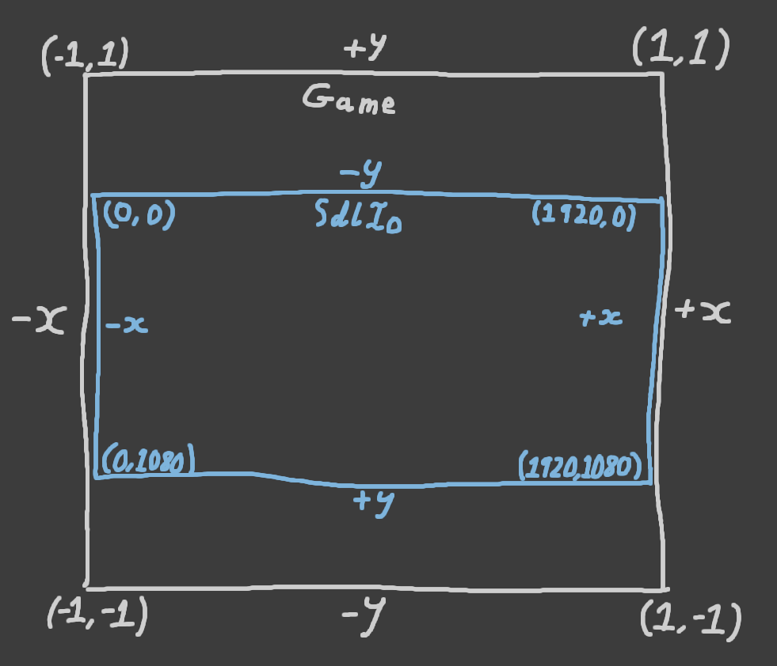
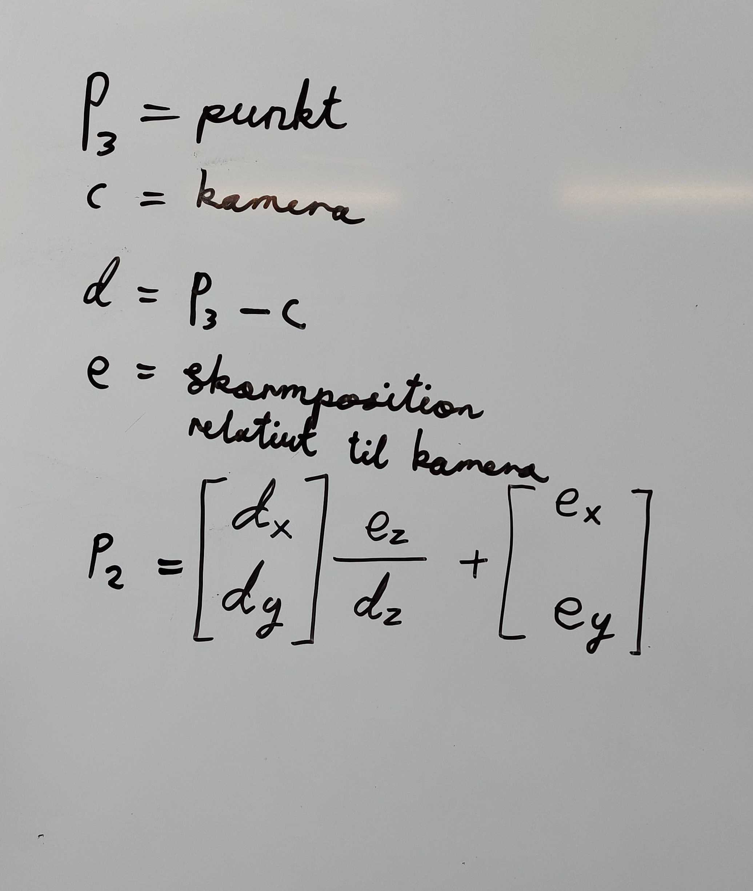
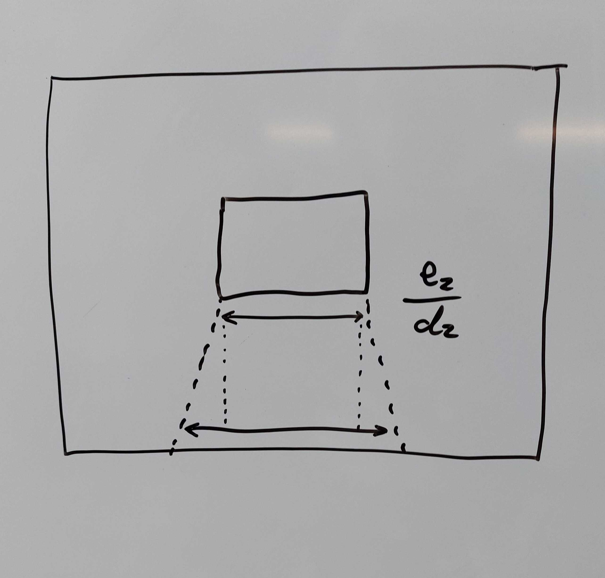
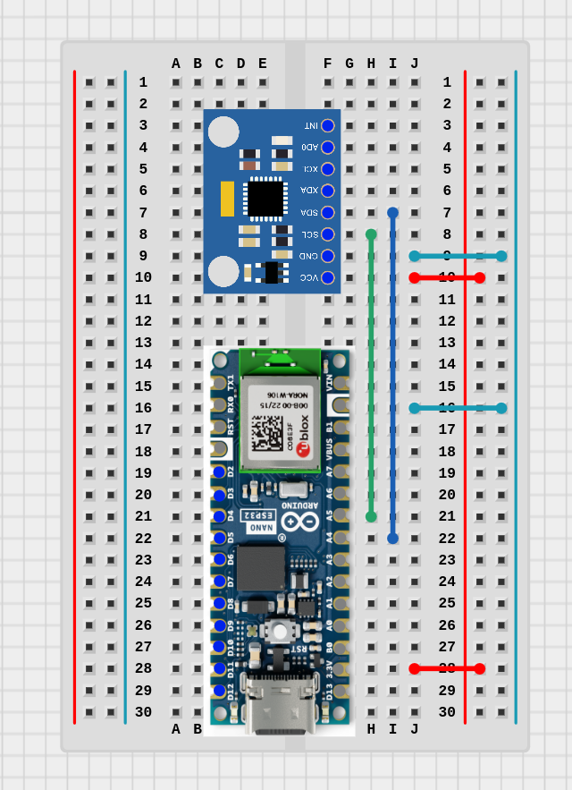
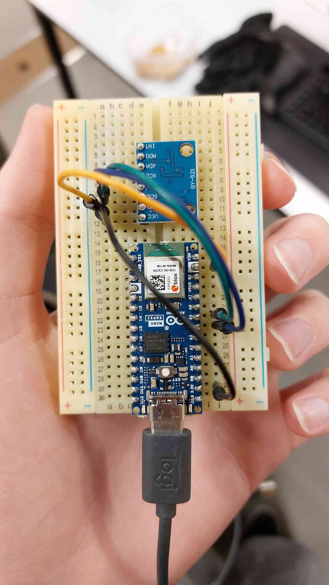

# Skateboard-slope - Produktrapport

**Skateboard-slope er et singler-player-spil, hvor spilleren styrer et objekt ned af en bane og undgår forhendringer på vejen. Spillet styres af en fysisk skateboard-device.**

Løsningen består af 1) et spil implementeret som en Desktop-applikation, 2) en Skateboard-device implementeret som en embedded device men en ESP32-S3 og en MPU6050 kombineret accelerometer og gyroskop, 3) en backend-server som understøtter kommunikation over MQTT og over vores in-house TCP-protokol, og 4) en CI-opsætningen med pipelines for hvert kodeprojekt.

Koden samt yderligere materialer ligger i Github repo'et[1].

## Spillet

Spillet er implementeret som en Desktop-applikation. Applikationen er skrevet i Rust som et Cargo-projekt. Spillets brugerflade er grafisk og bruger 3D-rendering. Applikationen bruger SDL3 til 2D-rasterizering og operativsystem-IO og inhouse 3D-projektion til at rendere 3D.

Koden ligger i `game/` i repo'et.

For at køre spillet, installer Rust, SDL3 og SDL3_ttf, og kør `cargo run`.


### Vindue, taster-input og 2D-rasterizering

Vi har valgt at skrive spillet i Rust. Dette har vi valgt, fordi vi alle har tidligere erfaring med at lave spil i Rust som Desktop-applikationer med SDL (SDL2). Vi har oplevet Rust som godt til Desktop-applikationer med kompleksitet og performance-krav. Diskuterede alternativer er C++ og Typescript. Siden vi ikke har lige så meget erfaring med C++ som gruppe blev dette valgt fra. Vi vurderede, at Typescript ikke passede godt til vores behov. Dele af vores applikation ligger tæt på operativsystemet i abstraktion, og vi har mindre erfaring med at udvikle med sådanne behov i Typescript end i Rust.

Spillet er en grafisk applikation, som skal kunne renderer til skærmen og reagere på input fra spilleren. Til at implementere denne funktionalitet har vi valgt at bruge library'et SDL3 (Simple Direct Medialayer)[2]. Specifikt benytter vi Rust-*crate*'en *sdl3*, som udsteder SDL3's API i et Rust-agtigt interface.[3] SDL3 er den relativt nye version af library'et, hvor SDL2 er stadig mere populært.

Vi har valgt at bruge SDL3 af flere grunde. Den første grund er, at vi har arbejdet med SDL før. Dette gjorde det nemt for os, at lave en opsætning vi kunne bruge. Vi ville derved hurtigt finde ud af, om det passede til vores behov, vi skulle skifte til noget andet. Vi konkluderede, at det passede til vores behov.

Den anden grund er, at SDL's designprincipper passer godt ind i vores problemstilling. Vi vil gerne lave en cross-platform applikation samtidig med at implementere store dele af det grafiske selv. SDL tilbyder en letvægts platformagnostisk API, som gør det nemt at lave simpel og effektiv 2D rendering og nemt at opsamle og håndtere tastatur-input. Samtidig er der lille kompleksitet bygget ind i SDL. Istedet er designprincippet at udstede primitive API'er, så det er nemt for library'ets brugere at implementere det nødvendige funktionalitet.

Alternativer til SDL3 er først og fremmest SDL2. Vi valgte, at bruge den nye version, da vi vurderede, at versionen er moden nok, og at vi gerne ville lære forskellene mellem de 2. Vi har fundet meget få forskelle. Andre alternativer kunne være *bevy*[4]. Bevy er mere *batteries included* end SDL3. Oven i mere uddybet 2D-rendering tilbyder bevy mange andre features, som vi ikke behøver. Derudover dikterer bevy arkitekturen i koden, herunder tæt kobling med bevy's ECS-system.

Vi har 2 behov, som SDL3 skal udfylde. Det første er IO-håndtering. Dvs. oprettelse af et Desktop-vindue og håndtering af applikations-events. Det andet er rendering (rasterizering) af 2D-geometri. Dvs. en måde at tegne 2D-trekanter i farver på skærmen.

Funktionalitet til 2D-renderingen er beskrevet som et Rust trait (interface) `trait Renderer` i `src/engine/game.rs`. Dette trait definerer de funktioner, vi skal bruge til at tegne geometri, hovedsageligt `fn draw_triangles`. Dette trait er implementeret for objektet (Rust struct) `struct SdlIo`, defineret i `src/game/sdl_io.rs`. Dette struct indeholder alt SDL-specifik kode. Trait'et er implementeret, så at de positioner og størrelser man passer i `Renderer`'s funktioner er normaliserede i et koordinatsystem. `SdlIo` implementation oversætter disse positioner og størrelser til reelle skærm-værdier.



Funktionalitet til vindue- og event-håndtering er også enkapsuleret i `struct SdlIo`. Interface'et mellem `SdlIo` og spillet er defineret i `trait engine::Game` trait'et. Dette trait definerer funktioner, som defineret af spillet og kaldet af `SdlIo`. Dette består af `fn update`, `fn render` og `fn event` funktionerne.

Vi har så vidt muligt forsøgt at enkapsulere SDL3-afhængigheden bag library-agnostiske interfaces. Dette gør at SDL3-specifik kode er begrænset til `SdlIo`. Dette gør også, at vi har et præcist interface, som beskriver vores behov. Dog introducerer det en smule kompleksitet i Rust, når man gemmer implementeringsdetaljer bag interfaces, hvis man forsøger at undgå at introducere overhead samtidig. Eksempelvis er sammenkoblingen defineret med generics og lifetimes, som kræver at man holder tungen lige i munden, når man definerer interfacet og implementerer begge sider.

### 3D-rendering

Vi vil gerne lave 3D-rendering til vores spil. Vi har valgt at implementere 3D-rendering inhouse. Grunden til dette er hovedsageligt, at vi tænkte, det ikke ville være sværre at lave selv, end at hente et library. I begge tilfælde skulle vi sætte os ind i kompleksiteterne ved 3D-rendering. 3D-renderingskoden ligger primært i `src/engine/scene.rs` og `src/engine/math.rs`.

3D-rendering, eller retter 3D-projektering er primært et matematisk problem. Vi har defineret nogle matematiske primitiver, og defineret diverse operationer, som er nødvendige for 3D-projektioner. Disse ligger i `src/engine/math.rs`. Dette inkluderer 2D-vektor `V2`, 3D-vektor `V3`, 2D- og 3D-trekanter `Triangle2` og `Triangle3` og 3x3 matrice `M3x3`. På de forskellige primitiver har vi defineret diverse matematiske operationer såsom sammenlægning og fratrækning af 3D-vektorer, gange med skalarværdi, længde af vektor, prik- og krydsprodukt, distance mellem 2 vektorer, osv. Nogle operationer er defineret som method-funktioner, eksempelvis `V3::cross`. Andre er implementeret med indbyggede Rust operatorer såsom `std::ops::Add` og `std::ops::Mul<f64>` for `V3`. Alle skalarværdier er repræsenteret med IEEE 754 double-floating point-tal, som i Rust staves `f64`, for 64-bit float.

3D-projektionen er implementeret med *Perspective Projection*[5] som funktioner på `V3` og `Triangle3` i methods ved navn `project_2d`. Følgende formel er anvendt:




Pointen med formelen er at 2D-positionerne bestemmes via forskellen mellem skærmen og punktet på z-aksen i 3D. Dvs. jo længere væk et punkt er, dvs. jo større forskellen er på z-aksen, jo tættere på midten vil punktet ligge i 2D. Dvs. objekter tæt på skærmen vises som større og objekter, der ligger længere væk, vises som mindre. Det er dette, der giver effekten af 3D.

Udregninen er defineret på 3D-vektor-struct'et `V3`:

```rust
// src/engine/math.rs
pub fn project_2d(&self, camera_pos: V3) -> V2 {
    let a = *self;
    let c = camera_pos;
    let d = a - c;
    let e = V3(0.0, 0.0, 1.0);
    V2(e.2 / d.2 * d.0 + e.0, e.2 / d.2 * d.1 + e.1)
}
```

Derudover er `project_2d` også implementeret på `Triangle3`, som producerer en `Triangle2`:
```rust
// src/engine/math.rs
pub fn project_2d(&self, camera_pos: V3) -> Triangle2 {
    Triangle2(
        self.0.project_2d(camera_pos),
        self.1.project_2d(camera_pos),
        self.2.project_2d(camera_pos),
    )
}
```
Det væsentlige er her at se, at projektionen på trekantent bare er projektionen af alle punkter i trekanten.

**Note:** Måden hvorpå vektorerne i disse beregninger vender, gør at vi arbejder med et venstrehåndskoordinatsystem, hvor Y peger opad. Dette betyder, at hvis du holder din venstre hånd op foran dig, peger tommelfingeren mod højre, pegefingeren op og langefingeren væk fra dig, så repræsenterer din tommelfinger, pegefinger og langefinger henholdsvis retningen af X-, Y- og Z-akserne i koordinatsystemet. Dette er vigtigt et stykke længere nede i rapporten.

Ovenstående giver funktionalitet for at udrenge positionerne for enkelte trekanter fra 3D til 2D. For at rendere de scener, vi skal bruge i spil, vil vi gerne kunne rendere komplicerede figure der består af flere trekanter. Vi har valgt at implementere, så vi kan rendere kasser (boxes) og plader (planes). Figurene er defineret i `src/engine/shapes.rs`. Her er de defineret en liste af *vertices* (punkter), en liste af edges (2 vertex indices hvor punkterne udgør en edge, dvs. en kant) og en liste af faces (3 vertex indices hvor punkterne udgør en face, dvs. en overflade).

Figurene skabes og håndteres med `struct Shape` struct'et. Med dette struct kan man skabe en figure ud af de prædefinerede, som så skaleres efter behov. Structet har methods, så man kan iterere over vertices, edges og faces i form af `V3`- og `Triangle3`-værdier. Formerne kan også roteres og flyttes.

For at tegne shapes, dvs. flere trekanter på en gang, har vi implementeret `struct Scene` structet. Dette er defineret i `src/engine/scene.rs`. Formålet med dette struct, er at man kan bygge en scene og så rendere den. Når scenen renderes sørger structet for at tegne alle trekanter i den rigtige rækkefølge. Trekanter udenfor skærmen og trækanter der vender væk fra skærmen renderes ikke. Den er implementeret, ved at den akkumulerer en liste af trekanter sammen med hver trekants normalvektor og farver. Når `Scene::render` kaldes, sorteres alle trekanter ift. distance fra skærmen, derefter itereres der over alle trekanter, projektioner udregnes og trekanterne tegnes med `Renderer::draw_triangle`.

#### Sortering af trekanter

Først lidt om, hvorfor trekanterne skal sorteres. Når man renderer trekanterne, tegner man som sådan alle trekanter på skærmen. Dvs. hvis 2 eller flere trekanter overlapper hinanden i 2D-projektionen, så er vi nødt til at vide, hvilken trekant vi skal tegne først. Vi vil gerne gøre, så at den tættest på liggende trekant tegnes sidst, så den er forest på det renderede billede.

For at sortere trekanterne, udregnes en score for hver trekant. En trekants score er regnet, ved at regne hvert punkts afstand til kamera'et og så ganges distances for de to tætteste punkter. Dette er koden, som foretager denne beregning og sortering:

```rust
// src/engine/scene.rs
let mut indices_with_scores = self
    .tris
    .iter()
    .enumerate()
    .map(|(i, (tri, ..))| {
        let mut p_scores = [tri.0, tri.1, tri.2]
            .map(|p| (camera_pos - p).len());

        p_scores.sort_by(|a, b| a.total_cmp(b));

        let score = p_scores[0] * p_scores[1];
        (i, score)
    })
    .rev()
    .collect::<Vec<_>>();

indices_with_scores.sort_by(|a, b| b.1.total_cmp(&a.1));
```

Der der er værd at se, er at `p_scores`, som er hvert punkts score, udregnes ved at regne hvert punkts afstand til kameraet. Dernæst sorteret `p_scores`, så de tætteste punkter ligger i `[0]` og `[1]`, som derefter bruges til at regne den totale score. Til sidst sorteres `indices_with_scores`, så den længst væk liggende trekant ligger først.

Denne algoritme til at beregne score er vi kommet frem til gennem eksperimentering. Om dette er den optimale algoritme, ved vi ikke. Et populært alternative til at benytte en algoritme på denne måde er Z-buffering[6]. Her beregnes afstanden for hvert enkelt pixel, og man opnår derved perfekt rendering af overlappende trekanter. Ulempen ved Z-buffering er, at det er beregningstungt. I realtidsapplikationer (såsom et spil) kan det derfor ikke svare sig, hvis man laver 3D-udregninerne på CPU'en. Det er ofte, at man foretager 3D-beregninerne på GPU'en istedet. Det gør vi ikke af flere årsager, så det behøver vi ikke at bekymre os om. Istedet er vores metode, at udregne en aggrigat-værdi for hver trekant. Dvs. istedet for en afstandsberegning for hvert pixel, laver vi 3 afstandsberegninger for hver trekant og en sortering af de 3 værdier.

#### Filtering af trekanter

Ikke alle trekanter skal tegnes på skærmen. Trekanter som vender væk fra kameraet, eksempelvis bagsiden af en kasse, bør ikke tegnes. Trekanter, hvis punkter ligger bag kameraet bør heller ikke tegnes. Dels vil de ikke være på skærmen, men matematikken bliver også utilregnelig når punkterne ligger meget tæt på eller bag kameraret. Derudover sparer vi også noget CPU-tid, ved at vælge trekanter fra generelt.

For at filtrere trekanter fra, som ligger bag kameraet, benytter vi, at scenens kameraretning er fastlåst i retning af z-aksen. Dette gør, at vi bare kan tjekke hvis et af punkter ligger bag kameraet på z-aksen. Følgende kode udfører denne beregning, og hopper fremad i loop'et, hvis det er relevant:

```rust
// src/engine/scene.rs
for v in [tri3.0, tri3.1, tri3.2] {
    if v.2 < camera_pos.2 {
        continue 'render_tri_loop;
    }
}
```

For at filtrere trekanter fra, som vænder væk fra kameraet, benytter vi trekanternes normalvektor. Hvis prikproduktet af normalvektoren og afstanding mellem et af punkterne og kameraret er negativt, så ved vi, at trekanten vender i samme retning som kameraet. Vi kan derfor springe sådanne trekanter over. Dette er koden, som laver denne håndtering:

```rust
// src/engine/scene.rs
if normal.dot(camera_pos - tri3.0) < 0.0 {
    continue;
}
```

#### Rendering af scene

Spillet består primært af en enkelt scene. Denne scene er bygget op med forskellige objekter. Disse objekter er defineret som structs, inkluderende `struct Skateboard`, `struct Segment`, `struct Obstacle`, `struct Ground`. Disse er alle sub-objekter på `struct Game`. I `game::Render`-metoden, renderes scenen ved at hvert objekt renderer sig selv i et `Scene`-objekt. For at renderer figure bestående af flere figure, bruges `struct ShapeGroup` struct'et. Dette er en samling a `Shape`-objekter som kan håndteres som en samlet enhed.

Når en figur renderes (normalvis i en `render` metode), instantieres et `Shape` objekt. Objektet skaleres, roteres og flyttes til den ønskede destination i scenen. Dette gøres med 3D-vektormatematik. Både `ShapeGroup` og `Scene` giver muligheder for at rotere og flytte flere objekter som en enhed.

#### Kommunikation med backenden

Kommunikation med backend'en er enkapsuleret i `struct Server`-structet. Selvom den nok skulle have heddet `Backend`, så er den ansvarlig for at opsætte og vedligeholde forbindelsen til backenden. Kommunikationen benytter vores inhouse TCP-protokel. Pt. består den af et endpoint, som opretter en stream af sensor data.

`Server`-struct'et har en metode `subscribe`, som kaldes med en callback-funktion. Denne metode registrer spillet i backend'en, sætter en datastream op, og kalder callback-funktionen for hvert sensor-measurement, der modtages fra backenden.

I spilkoden bliver disse events samlet i en event queue. Event queue'en er en FIFO-buffer implementeret med Rusts `VecDec`-kontainer. Siden event queue'en skal virke over en thread boundary, er det nødvendigt med synkronisering. Dette gøres med Rust's `Arc<Mutex<T>>` type-pattern[7].

I `Game::update`-metoden tjekkes event queue'en for, om der er blevet tilføjet nye events. Hvis der er, så tømmes queue'en, og hver værdi bruges til at styre skateboardet.

## Skateboard

Skateboard'et er implementeret med en Arduino Nano ESP32, hvori der sidder en ESP32-S3 chip. Tilkoblet ESP32'eren er en MPU6050, som er et kombineret elektronisk accelerometer og gyroskop. ESP32'eren læser værdier fra MPU6050'eren via en inhouse driver, og sender dataen til backend'en over MQTT. Skateboardet finder via WiFi til backenden via en indbygget konfiguration. Firmware'en benytter timers, preemptive multitasking og andre features fra IDF's version af FreeRTOS, til at håndtere kommunikation med MPU'en og backenden i seperate processor med tidsmæssig decoupling.

Koden ligger i `skateboard/` i repo'et.

Vi har valgt at bruge en ESP32, specifikt en ESP32-S3[16], produceret af Espressif, på et Arduino Nano ESP32 development board[17]. Vi ønskede en chip med den funktionalitet, vi skulle bruge, hovedsageligt en MHz CPU, WiFi, en I2C bus og nem udvikling. ESP32 med Espressif's development framework tilbyder features i en relativt kost-effektiv pakke. Alternativer til en ESP32 kunne være Atmel AVR, ARM Cortex eller STM32 chips. Med tidligere erfaring med alle tre alternativer, var valget også taget for læringsmæssige formål.

Ikke at forveksle med de Israelske angrebsstyrker, ESP-IDF er Espressif's development framework (IoT Development Framework)[18]. ESP-IDF er et batteries included framework bestående af værktøjer, bootloaders, drivers og libraries til at udvikle firmwares til ESP32 chips. En ESP-IDF-applikationer er skrevet i C med CMake, med diverse libraries og CMake plugins.

### Skateboard-firmware

Til skateboardet har vi lavet et ESP-IDF projekt. Hertil hører der en `CMakeLists.txt`-fil, en `main`-mappe, en `main/CMakeLists.txt`-fil, en `Kconfig.projbuild`-fil og C- og H-filer i `main/`. Den første CMake-fil beskriver projektet og sætter aktiverer ESP-IDF's plugins. CMake-filen i `main/`-mappen beskriver, specifikt for main-komponentet, hvilke filer der skal kompileres og hvilke drivers (komponenter), som dette komponent afhænger af. `main/Kconfig.projbuild`-filen beskriver den konfiguration, som komponentet tilbyder. Konfigurationsmuligheder beskrevet her, vil dukke op i ESP-IDF's samlede konfigurationsmenu (`idf.py menuconfig`), og værdierne vil herefter være tilgængelige i C-koden. Mere om byggesystemet kan findes i manualen[19].

I skateboard-firmware'en har vi 4 hovedkomponenter (konceptuelt, ikke ESP-IDF-komponenter):
- **Wifi interface:** Skateboardet skal forbinde til vores Linux-server på netværket, for at kunne kommunikere med Mosquitto message broker'en over MQTT. Dette er et interface over ESP-IDF's WiFi driver, specialiseret til vores formål.
- **MQTT interface:** Ligesom WiFi-interface'et er dette et interface over ESP-IDF's MQTT specialiseret til vores formål.
- **MPU6050 driver:** Vi oplevede problemer med eksisterende MPU6050 drivers, så vi valgte at skrive vores egen. Driveren benytter ESP-IDF's I2C driver og kommunikerer med MPU'en efter beskrivelsen i manual'en.
- **Måle og sende-timing:** Det er skateboardets ansvar at læse fra sensoren og sende dataen til serveren periodisk. Der er forskellige behov til de 2 processer. De er derfor implementeret med ESP-IDF's high resolution timers og ESP-IDF's variant af FreeRTOS til preemptive multitasking.

#### WiFi interface

Vi har brug for WiFi til at forbinde til MQTT message brokeren på Linux-serveren. WiFi-funktionalitet er enkapsuleret i `AppWifi`-typen med associerede funktioner, defineret i `main/app_wifi.h` og  `main/app_wifi.c`. Pt. er dette interface'et til WiFi:
```c
void app_wifi_init(AppWifi* wifi);
```

Vi har valgt at skrive et interface, for at skille ESP-IDF specifik WiFi-kode fra resten af vores applikation. Vi opnår derved, at vores øvrige kode bruger en lille og præcist interface, mens implementeringsdetaljerne enkapsuleres bag interface'et. Alternativt til dette, kunne vi have valgt at flette ESP-IDF WiFi-koden sammen med resten. Ulemperne med sådanne abstrahering, er at vi skal skrive mere kode, og det er mindre gennemskueligt, at benytte ressourcerne effektivt. Fordelene derimod, er primært at den mentale load sænkes på i WiFi-koden og i den øvrige applikation. Enten tænker man på WiFi-implementeringsdetaljer, eller også tænker man på det simple interface og resten af applikationen. Det er ikke nødvendigt at holde begge i hovedet samtidig. Udover dette, opnår vi også en løs kobling mellem ESP-IDF WiFi-driveren og resten af applikationen. Dette gør, at det er nemt at skifte WiFi-driver, i tilfælde af, at vi vælger at bruge en anden driver.

WiFi interface'et bruger ESP-IDF's WiFi-driver. Derudover bruges forskellige features fra ESP-IDF's variant af FreeRTOS. WiFi driver'en laver ikke selv fejlhåndtering i tidsmæssig forstand. Eksempelvis efter kan kalder `esp_wifi_start()`, så er det ens eget ansvar at tjekke efter løbende events såsom fejl og oprettede forbindelser. Dette gør vi med FreeRTOS's event handler og event group-funktionalitet. Her bruger vi event group-funktionerne som en ventemekanisme sammenligneligt med en condition variable.

Konfigurationen af WiFi, dvs. SSID og password er konfigureret igennem Kconfig-menu'en. Dvs. man i configure time (før compile time) indtaster sit ønskede netværks-credentials. Dette er en midlertidig foranstaltning. I en videreudviklet version, bør man kunne konfigurere netværket i run time, eksempelvis via en mobilapp.

Et alternativ til at skulle konfigurere WiFi kunne være, at produktet salges sammen med et access point. I sådanne setup ville man også kunne bruge Bluetooth, som eksempelvis Wii Remote benytter[20]. Alternativt kunne man forbinde produktet direkte til computeren, hvor spillet køre. Vi valgte, at bruge WiFi i denne konfiguration, da vi vurderede, at det ville gøre udvikling simplest, og tillade at vi hurtigere kunne udvikle spillet.

#### MQTT interface

MQTT interface'et er enkapsuleret i `AppMqtt`-typen med associerede funktioner, defineret i `main/app_mqtt.h` og `main/app_mqtt.c`. Interface-funktionerne er defineret følgende:
```c
void app_mqtt_init(AppMqtt* mqtt);
void app_mqtt_subscribe(AppMqtt* mqtt, const char* topic, AppMqttSubCb callback, void* arg);
void app_mqtt_publish(AppMqtt* mqtt, const char* topic, const void* data, size_t size);
```

Disse funktioner udsteder præcist det interface, vi skal bruge i applikationen. Dvs. funktionalitet til at subscribe på `/skateboard/config` og publish på `/skateboard/update`. Vi bruger igen FreeRTOS's event system til at håndtere MQTT events. Vi opretholder et liste af subscriptions, som er dem interface'et lytter efter. Når man tilføjer en subscription, giver man en callback-funktion, som kaldes, når data modtages.

```c
static void configure_cb(
    const char* topic,
    size_t topic_size,
    const void* data,
    size_t data_size,
    void* arg);

app_mqtt_subscribe(&mqtt_client, "/skateboard/configure", configure_cb, /*...*/);

app_mqtt_publish(&mqtt_client, "/skateboard/update", msg_buffer, msg_size);
```

Grunden til at vi har lavet et interface over ESP-MQTT's driver er de samme som for WiFi interface'et.

#### MPU6050

Til måling af vinklen på skateboardet har vi valgt at bruge en MPU6050 kombineret gyroskop og accelerometer. Vi skal bruge en måde at måle vinklet på skateboardet elektronisk. Vi overvejede også andre muligheder. Eksempelvis kunne man måle vinklen med en aktuator med en mekanisme. Vi vurderede, at vi ville starte med at eksperimentere med et gyroskop/accelerometer.

Ved at undersøge projekter på internettet med Arduino eller ESP32 og accelerometre og gyroskoper, fandt vi frem til at MPU6050 var den mest populære. Vi valgte den hovedsageligt ud fra populariteten, da et mere populært komponent sandsynligvis har flere og bedre drivers og andet support.

MPU6050'eren er forbundet til ESP32'eren via I2C. Modulet får også strøm fra ESP32-board'et. Pin-konfigurationen er at `VCC` og `GND` på MPU'en er forbundet til `3.3V` og `GND` på ESP32-board'et, og `SCA` og `SCL` er forbundet til henholdvis `A5` og `A4` på boardet.




General information om brug af MPU6050 kan findes i produktspecifikationen (databladet)[21]. MPU6050 kan køre på, og bliver forsynet med 3.3V. I2C-bussen skal have, og har, en clock rate på 400MHz. Opsætning af MPU'en gøres ved at skrive til I2C registers og læsning af målinger ved læsning af registers.

Vi har valgt at lave vores egen driver til MPU6050. Vi eksperimenterede med 2 eksisterende drivers. Vi oplevede, at de havde outdatede dependencies og fejl i funktionaliteten. Ved at studere koden i de 2 drivers, vurderede vi, at det nemmeste ville være, at skrive vores egen ud fra manualen.

Driveren er defineret i `main/mpu6050.h` og `main/mpu6050.c`. Her defineres typen `Mpu6050` samt adskillige typer og funktioner, til konfigurering og benyttelse af sensor-modulet. MPU6050's register map (programmeringsmanual) beskriver hvordan man via I2C kan konfigure og benytte modulet[22].

Disse er de mest væsentlige funktioner i driveren:
```c
esp_err_t mpu6050_init(Mpu6050* dev);

esp_err_t mpu6050_get_rotation(Mpu6050* dev, float3* rotation);
esp_err_t mpu6050_get_acceleration(Mpu6050* dev, float3* accel);

esp_err_t mpu6050_calibrate(Mpu6050* dev, const float3* initial_rotation);
```

Hvor WiFi- og MQTT-interfaces'ne er specialiserede interfaces der bygger ovenpå indbyggede drivers, så er dette komponent en generel MPU6050 driver (ikke komplet, men som design). Der er nogle forskelle i designvalgende på grund af dette. For det første er fejlhåndteringen anderledes. I interfaces'ne håndteres fejltilstande internt i interfaces'ne, tilfordel for et simpel interface ud til resten af applikationen. I denne driver bliver alle fejl *propagated* ud til driverens *consumer*. Hertil bruges den indbyggede `esp_err_t`-type per konvention.

En anden forskel er, at de 2 interfaces har meget små interfaces, med målet om kun at tilbyde, hvad vores specifikke applikation har af behov. I driveren udstedes alle MPU6050'ens funktioner i interface'et. Vi har forsøgt at gøre driveren apolitisk, i den forstand, at den har fleksibilitet, så den kan bruges til at som de fysiske hardware er i stand til. Dette har vi valgt, da de kan gøre udviklingen af både driveren og af resten af applikation som skal bruge den nemmere.

> Though it may be strange to say that a driver is "flexible," we like this word because it emphasizes that the role of a device driver is providing *mechanism*, not *policy*.
>
> ... Most programming problems can indeed be split into two parts: "what capabilities are to be provided" (the mechanism) and "how those capabilities can be used" (the policy). If the two issues are addressed by different parts of the program, ... the software package is much easier to develop and to adapt to particular needs.[23]

For at bruge MPU6050'eren med driveren, bruger man de udstedte funktioner. `mpu6050_init()`-funktionen initialisere en MPU6050-device med en associeret struct-værdi, som indeholder diverse state, som driveren bruger internt. Før MPU-modulet kan bruges, skal det kalibreres. Dette gøres med `mpu6050_calibrate()`-funktionen[24].

Efter modulet er kalibreret, kan man aflæse værdierne med `mpu6050_get_rotation()` og `mpu6050_get_acceleration()`. Disse funktioner returnere sensorens aflæste værdier korrigeret for kalibreringen. `mpu6050_get_acceleration()` returnerer en 3D-vektor, hvor hver af værdierne repræsenterer accelerationen, der påvirker MPU'en på henholdsvis X-, Y- og Z-akserne. `mpu6050_get_rotation()` returnerer en 3D-vektor, hvor hver af værdierne repræsenterer vinkel*accelerationen* om hver af akserne.

**Note:** Husk hvordan spillets har et venstrehåndskoordinatsystem med Y som vertikalakse. MPU'en tilforskel repræsenterer sine målinger i et højrehåndskoordinatsystem, Z aksen peger opad. Det vil sige, at hvis du holder din *højre* hånd foran dig, peger tommelfingeren til højre, pegefingering væk fra dig og langefingeren opad, så repræsenterer din tommelfinger, pegefinger og langefinger henholdvis MPU'ens X-, Y- og Z-akse. Desuden er MPU'en vendt på hovedet på breadboardet. Vores system skal håndtere konverteringen mellem de to koordinatsystemer. Dette gøres i `main/skateboard.c`, når vi laver vinkelberegningen.

Enheden for *g* for acceleration og *°/s* (grader per second) for rotation (vinkelacceleration). Sensorens måleopløsning kan indstilles med konfiguration. I vores applikation er opløsningen ±2g for acceleration og ±250°/s for rotation.

Aflæsningen af enhederne skal foretages synkroniseret med MPU'ens sample rate. Denne sampling rate kan indstilles forskelligt med forskelligt konfiguration. ~~I vores applikation bruger vi en sampling rate på 25Hz. Dette betyder, at MPU'en foretager 25 målinger i sekundet. Vores firmware skal derfor læse sensor-dataen i intervaller med tidsmæssigt mellemrum på 40 millisekunder.~~ (Dette er ikke sandt. Dette er, hvad vi ville have gjort. I virkeligheden, så havde programmøren ikke tænkt på, at når DLPF ikke er sat, så er den 0, dvs. en sampling rate på 8 kHz på gyroskopet og 1kHz på accelerometeret. I øvrigt glemte programmøren at ændre sample rator divisor'en tilbage fra 3. Dvs. vores reelle sampling rate, udregning med sampling rate-ligningen fra manualen, er `8 kHz / (3 + 1) = 2 kHz` for gyroskopet og `1 kHz / (3 + 1) = 250 Hz` for accelerometeret. For at udlæse værdierne korrekt fra gyroskopet skal vi da vente `1 / 2 kHz = 500 µs` mellem læsninger og `1 / 250 Hz = 4 ms` mellem læsninger fra accelerometeret. Resten af firmware-koden venter de originale 40 millisekunder. Konsekvensen er her, at målingerne imellem vores læsninger går tabt. Den sidste måling siden sidste læsning (som er en acceleration) bliver istedet anvendt for hele perioden. Dette gør vores aflæste målinger mindre repræsentative for de faktiske accelerationer og rotationer på MPU'en. Dog gør det ikke en stor forskel, da den sidste måling i hver periode er en god approximering af den totale acceleration/rotation i perioden. Vi har ikke oplevet det som en fejl i vores system. Dette er den ene af to grunde til, at jeg lader det forblive sådan. Den anden er, at vi i skrivende stund har integreret og testet hele den del af systemet. Jeg vurderer, at risikoen i at forsøge at ændre dette, er en større pris end gevindsten.)

#### Beregning og transmission af vinkel

Formålet med firmware'en er at måle og udregne skateboardets vinkel, så det kan bruges til at styre spillet. Firmware'en skal derfor kunne måle en korrekt vinkel på skateboardet. Vinklen regner vi ud fra accelerationsmålingerne op MPU'en. Derfor er det første led i denne kæde, læsning af data fra MPU'en.

MPU'en sampling rate er 25 Hz, dvs. vi kan aflæse nye værdier hvert 40. millisekund. Vi bruger ESP-IDF's high resolution timers til at lave et timer-loop, hvor en callback-funktion kaldes kontinuerligt hvert 40. millisekund. I hvert kald aflæses accelometerværdierne, og en vinkel beregnes herudfra.

Vinkel regnes ud fra accelerometerdataen. Dette er muligt, da tyngdekraften påvirker accelerometeret, som derfor giver en måling på 1g i den retning, der peger nedad. Vi har valgt, at vinkel skal være vinkel af skateboardets rotation on X-aksen. Vi kan bruge følgende formel, til at regne retningen på tyngdekraft om til rotation om X-aksen:

$ \theta = tan^-1 \left( \dfrac{ A_x }{\sqrt{A_y^2 + A_z^2}} \right) $

Læsning af data og beregning af vinklen implementeret følgende:
```c
static float calculate_accel_axis_angle(
    float axis, float tangent0, float tangent1)
{
    return atan(axis / sqrtf(tangent0 * tangent0 + tangent1 * tangent1))
        * (1.0f / (M_PI / 180.0f));
}

static void mpu_timer_cb(void* arg)
{
    App* app = arg;

    float3 accel = { 0 };
    ESP_ERROR_CHECK(mpu6050_get_acceleration(&app->mpu, &accel));

    app->rotation = calculate_accel_axis_angle(accel.x, accel.y, accel.z);
}
```

Her ses det, at libc's `atan()`-function regner i radianer, hvor MPU'en og vores system bruger grader. Konvertering er derfor nødvendig.

Den beregnede vinkel skal herefter sendes til serveren. Vores kommunikation med serveren, og derfor også med spillet, er begrænset af kommunikationslagene derimellem. Gennem eksperimentering har vi fundet ud af, at kommunikationen er bedst, når skateboardet sender 10 gange i sekundet. Vi har derfor et timer-setup, som afvikler publish-koden med 100 millisekunders mellemrum. Dette timer-setup bruger FreeRTOS's task scheduling timer (`vTaskDelay()`) til at pause task'en i 100 millisekunder.

Vi bruger både FreeRTOS task scheduling[25] og ESP-IDF high resolution timers[26] forskellige steder i koden. Forskellen på de to i denne sammenhæng er primært at ESP-IDF high resolution timers er, som navnet siger, meget præcise med en opløsning i mikrosekunder. FreeRTOS's task scheduling funktioner har derimod en opløsning i 10'ere af millisekunder. Fordelen ved FreeRTOS funktionerne er at man har flere muligheder, for hvordan timing mekanismen skal virke, da man har adgang til preemptive multitasking-faciliteterne. 

Publish-koden laver et JSON-objekt i en string med nuværende vinkelværdi. Koden til at laver JSON-string'et og publishing er følgende:
```c
static void publish_message(App* app)
{
    int msg_size = snprintf(
        msg_buffer,
        msg_buffer_capacity,
        "{\"rotation\":% 9.4f}",
        app->rotation);

    app_mqtt_publish(&app->mqtt, "/skateboard/update", msg_buffer, msg_size);
    ESP_LOGI(TAG, "%.*s", (int)msg_size, msg_buffer);
}
```

Det ses, at en update-message eksempelvis kunne være `{"rotation":-49.321}`.

## Backend

Backend'en er en C++-applikation som hosted via Docker Compose på en Linux-server. Backend'ens formål er at forbinde skateboardet med spillet. Dette gøres over 2 protokoller. Skateboardet kommunikerer med backenden over MQTT. Dette gøres med Mosquitto som message broker, som også kører på Linux-serveren med Docker Compose. Spillet kommunikerer med backenden over en inhouse TCP protokol.

Koden ligger i `backend/` i repo'et.

Backend'en består konceptuelt af følgende komponenter: en Linux-server, en Mosquitto-instans, en C++-applikation, herunder en TCP-server, en MQTT-client, en JSON parser og et deployment miljø.

For at deploy backend'en kør `./deploy.sh`. Eventuelt byg og upload et opdateret backend-image ved at køre `./publish.sh`.

### Linux-server

Vores backend-opsætning ligger på en server som kører Debian. Vi har lavet en opsætning med en bruger hver, dvs. en `mtk`-, `sfj`- og `tph`-bruger. Vi har sat SSH op på brugerne, så vi kan forbinde til hver vores bruger gennem SSH med public/private-nøgler. Password-authentificering er slået fra for SSH. På serveren har vi sat *sudo* op, så bruger kan køre sudo-kommandoer uden password.

Vi har installeret Docker på serveren og Docker Compose. Vores deployment fungerer ved, at filerne synkroniseres op på serveren og `sudo docker compose up -d` køres. Vi har valgt at beholde, at man skal have root access til Docker, dels fordi det ikke gør stor forskel, dels fordi så er host-miljøet agnostics for, hvilken bruger der kørte up-kommandoen, og dels fordi, der er security issues ved at give alle adgang til Docker-systemet[10].

### Mosquitto-instants

Mosquitto[8] er sat op med Docker Compose via det officielle Docker image[9]. Instansen er konfigureret med filen `deploy/mosquitto.conf`, og authorisering er konfigureret i users-filen i `deploy/mqtt_users`. For nuværende er der en enkelt bruger `test` med password'et `1234`. Mosquitto-instansen lytter på port `1883` både internt og eksternt, og så tillader den anonyme brugere. Dette betyder, at authorisering ikke er nødvendigt. I vores setup benytter vi dog stadig username/password authorisering.

Vi har valgt at bruge Mosquitto, da softwaren selv er relativ simpel. Efter at eksperimentere med RabbitMQ besluttede vi, at RabbitMQ var for advanceret til vores behov. Vi fandt ud af, at vi med meget lille energi kunne tilføje en Mosquitto-instans til vores Docker Compose-opsætning, som dækkede vores behov.

Servicen er beskrevet følgende i `docker-compose.yml`-filen:
```yaml
mosquitto:
image: docker.io/eclipse-mosquitto
ports:
  - "1883:1883"
volumes:
  - $PWD/mosquitto.conf:/mosquitto/config/mosquitto.conf
  - $PWD/mqtt_users:/mosquitto/config/mqtt_users
```

### Server-applikation

Server-applikationen er skrevet i C++, specifikt C++23, og benytter Make som buildsystem. Applikationen afhænger af libmosquitto til at forbinde til Mosquitto-instansen over MQTT. `src/`-mappen indeholder source-filerne, `tests/`-mappen indeholder unittests og `deploy/`-mappen indeholder diverse filer, som backend'en bruger til deployment-miljøet.

Makefile'en definere diverse kommandoer til at verificere, bygge og teste backenden. For at bygge applikationen til release, kør `make RELEASE=1 build/backend`. For at køre tests, kør `make test`. For at køre bygge til debugging med GDB, kør `make GDB=1 all`.

En Docker image er beskrevet i `Dockerfile`. Docker-filen beskriver 2 images, `builder` som er byggemiljøet og `runner` som er runtime-miljøet. I byggemiljøet installeret alle dependencies til at bygge og teste applikationen, eksempelvis `mosquitto-dev`, som inkluderer de headers, som C++-compileren skal bruge, for at compile kode, der bruger libmosquitto. Efter applikationen bygges, bliver testene kørt. I runtime-miljøet installeres kun de pakker, som applikationen behøver i runtime, eksempelvis `mosquitto-libs`, som kun består af libmosquitto's runtime-libraries.

Til applikationen er der defineret en test-suite af unittests. Disse tests er standalone C++-applikationer, som inkluderer alt server-applikationskoden (udover `src/main.cpp`). Testene viser success/fail via. process return codes. Test-setup'et er "limet" sammen med følgende linjer i Make-filen:
```make
test_sources = $(shell find $(test_dir) -name '*.cpp')
test_targets = $(test_sources:$(test_dir)/%.cpp=$(build_dir)/$(test_dir)/test_%)

test: $(test_targets)
	printf "%s\n" $^ | xargs -I % sh -c 'echo "- %..." && ./% && echo "- %: OK" || (echo "- %: FAILED" && exit 1)'

$(build_dir)/$(test_dir)/test_%: $(obj_dir)/tests/%.o $(objects_without_main)
	@mkdir -p $(dir $@)
	$(LD) -o $@ $(CXXFLAGS) $^ $(LDFLAGS)
```

Projektet er sat op til udvikling med Clang-værktøjerne, specific clangd-sprogserveren[11]. clangd er sat op med `compile_flags.txt`, som er en primitiv måde at fortælle clangd, hvordan den skal fortolke koden. Filen beskriver de flag, som specificeres til compiler'en, når koden kompileres (og et flag `-xc++`, som fortæller at `.h`-filer er C++ og ikke C). Derudover er der en `.clang-format`-fil, som dikterer hvordan clangd og clang-format skal formatere koden. Her har vi eksempelvis sat indent-bredde til 4 (spaces) og kolonnemaksimum til 80:
```yaml
IndentWidth: 4
ColumnLimit: 80
```

#### MQTT-klient

Server-applikationen selv indeholder 2 primære komponenter. Den første af de to er MQTT-klienten. Dette komponent er enkapsuleret i `mst::mqtt::Client`-klassen, defineret i `src/mqtt.hpp` og `src/mqtt.cpp`. Implementationen bruger libmosquitto's C-API. Vi har valgt at bruge libmosquitto til implementering af klienten, da vi ønskede et simpelt library til håndtering af det tekniske i MQTT. Vi har valgt kun at bruge MQTT, dvs. fravælge AMQP, og at bruge Mosquitto som message broker. På grund af disse 2 grunde, valgte vi at bruge libmosquitto (Mosquitto's library og C-API). MQTT understøtter arbitrær data i beskederne, men vi har valgt, at alt kommmunikation over MQTT foregår med læselig text. Komponentet udsteder et interface, så man kan publish messages og subscribe på topics:
```c++
auto client = mst::mqtt::Client(/*...*/);

client.subscribe("/my/topic", [&](std::string_view text) {
    // ...
});

client.publish("/my/topic", "message to publish");
```

#### TCP-server

Det andet komponent er en TCP-server. TCP-serveren understøtter vores inhouse protokol til at kommunikere data til spillet. TCP-serveren er enkapsuleret i `mst::server::Server`-klassen, defineret i `src/server.hpp` og `src/server.cpp`. Serveren bruger Linux's (POSIX's) indbyggede socket-API. Vi har valgt at bruge denne API, da vi har et lille behov for funktionalitet. Vi ønsker en simpel og barebones TCP-server, og derfor egner den relativt primitive socket TCP/IP-API sig godt. Derudover viste vi, at serveren kun skulle køre i et Linux-miljø. Før vi valgte socket-API'en og TCP-protokollen undersøgte vi libmicrohttp. Vi konkluderede, at en inhouse TCP protokol og socket-API'en ville være nemmest og simplest stil vores formål. Til implementeringen brugte vi *Beej's Guide to Network Programming* som reference[12].


Serveren udstiller et interface som følgende:
```c++
auto server = mst::server::Server(/*...*/);

server.notify_subscribers(/*...*/);

server.listen();
```

`Server::listen()` starter TCP-serveren, ved at lave et socket med `socket()`, binde socket'en til en port med `bind()`, sætte socket'et til at lytte til connections med `listen()`. Socket'et sættes derefter i en file descriptor-liste, og programmet sættes derefter til at vente på events i file descriptor-listen med `poll()`. Når en ny klient forbinder, vågner serveren og opretter forbindelsen med `accept()`. Med en oprettet forbindelse kan serveren og klienten sende data frem og tilbage med `recv()` og `send()`.

Pt. er der et enkelt endpoint i TCP-protokellen: `Subscribe`. Et subscribe-kald fortæller serveren, at den skal tilføje clienten til listen af klienter, der skal modtage data fra (pt. singulært) skateboardet. Klienter forventes derefter at receive data fra serveren. Med `Server::notify_subscribers()` kan backend'en sende vinkel-data til alle registrerede subscribers. Som nuværende, sker dette i MQTT subscription handleren til topic'et `/skateboard/update`. Dvs. når skateboardet publish'er data til `/skateboard/update` over MQTT, sendes det videre til alle subscribers. Serveren har funktionalitet til håndtering af afbrudte og fejlståede forbindelser.

#### JSON-parser

I backend-applikationen er der en inhouse JSON-parser. Vi valgte, at bruge vores egen JSON-parser, da vi havde brug for den ekstra performance, vi kunne få ud af en custom implementering. JSON-parseren er enkapsuleret i `mst::json::Value` og `mst::json::parse()`, og defineret i `src/json.hpp` og `src/json.cpp`. JSON-parseren er originalt et C-projekt, som vi har ported til C++23. Med en hurtig tokenizer, fleksibel parser, vel-defineret interface og simpelt query-funktionalitet, forsøger JSON-parseren at være både hurtig og nem at bruge. Vores JSON-parser er ikke 100% standards complient[13], men den opfylder vores behov. Alternativer til en inhouse implementation kunne være nlohmann/json[14] eller simdjson[15]. Et eksempel (taget fra en unittest) er følgende:
```c++
auto object = *json::parse(R"( { "rotation": -0.0123 } )");

auto query_result = *object->query(".rotation");
auto f64_value = query_result->get_f64();

ASSERT_EQ(f64_value, -0.0123);
```

## CI

Til hver af de 3 kodeprojekter er der en CI opsætning, som udfører diverse verificeringer når kode bliver *push*'et. Opsætningen er lavet med Github Action Workflows[27]. Til hver af de 3 projekter er der sat en pipeline op, som kloner koden, bygger koden og udfører andre verificeringer. Vi benytter et custom Docker images som byggemiljøer i CI-miljøet.

Hver af de 3 pipelines er defineret i `.github/workflows/backend.yml`, `.github/workflows/game.yml` og `.github/workflows/skateboard.yml` henholdsvis. Disse pipelines er defineret som Github Actions. De bliver kørt, når kode *push*'es til hver af `backend/`-, `game/`- og `skateboard/`-mapperne. Dvs. backend'ens pipeline kører kun, når en commit ændre i filerne i `backend/`-mappen.

Vi har valgt at adskille pipelines'ne, for at undgå ressourcespild, og for at undgå, at man bliver overvældet af irrelevant information, når man kigger på pipeline runs for ens commits. Hvis game's pipeline fejler, så ville det være at foretrække, at skateboardets pipeline ikke fejler, hvis man push'er korrekt kode i skateboard-mappen.

Alle 3 pipelines bruger containers som runner-miljø. Skateboardet's pipeline bruger Espressif's eget image, med alle de nødvendige værktøjer `espressif/idf:release-v5.5`. Backend og game bruger custom images som byggemiljø. Images'ne er beskrevet i Docker-filer i `ci-images/`-mappen. Hver image indeholder de nødvendige pakker, for at køre pipelines for hver af projekterne henholdvis. Images'ne bygges og pushes til Docker Hub. Herfra kan Github hente images'ne og bruge dem i pipelines.

Vi har valgt at bruge images for at minimere pipelines'nes køretid. Uden containers, ville pipelines'ne skulle hente alle packages hver gang. Vi oplevede, at det tog betydelig tid, at installere diverse nødvendige pakker. Med images kan pipelines'ne istedet hente et samlet komprimeret image med alle pakkerne. Dette har givet en stor forbedring.

Skateboardets pipeline sørger for, at firmware'en kan bygge. Dette kan give en indikation, hvis en udvikler ved en fejl, push'er ukorrekt kode. Dette er en smoke test, dvs. den kan indikere en markant regression (koden ikke kan kompile), men den foretager ikke yderligere testing. Hvis min lærer læser dette, før jeg pointerer det, giver jeg en øl. Eksempelvis kan kode, som kompilere, stadig indeholde fejl, men denne test finder ikke sådanne fejl.

Game's pipeline bygger, kører unittests og kører linting. Unittestene i koden er meget basale og tester kun en meget lille del af det samlede program, men det giver alligevel mere værdi, end bare at bygge koden. Ved at køre unittests bliver selve programkoden eksekveret. Med dette, kan man eksempelvis også fange fejl, såsom forkert opsatte runtime-afhængigheder. De dele af programmet subjekt til unittest, testes selvfølgelig i en grad afhængigt at grundigheden af test-suite'en. Linting tilføjer ekstra checks, som compileren ikke nødvendigvis fanger. Dette er ofte tilfælde, hvor koden giver mening for compileren, men ikke nødvendigvis giver mening for programmøren. Oftest er det tilfælde, hvor koden sansynligvis gøre noget andet, end det programmøren forventer. Derudover kan linting også foreslå generelle forbedringer af koden. Linting laver også diverse andre checks, såsom konformitet til konventioner som variabel-navne.

Backend'ens pipeline bygger, kører unittests, ligesom game, men checker også formatteringen i koden. Dvs. hvis man push'er kode, hvor formatteringen, dvs. ikke-syntaktisk sammensætning i koden (mellemrum, linjeskift, m.m.), ikke er magen til det, som vores valgte toolchain ville gøre, så fejler pipeline'en. Dette tvinger udviklere til, at formatere koden efter de valgte konventioner specificeret i `backend/.clang-format`, eller bruge et program som clang-format til at gøre det automatisk.

Vi har valgt at implementere disse continuous integration pipelines primært for at styrke kodekvaliteten. CI pipelines sænker tiden det tager, at integrer og teste et system. De kan derfor bruges til at minimere tiden det tager, at få feedback på koden.

> Product teams can test ideas and iterate product designs faster with an optimized CI platform. Changes can be rapidly pushed and measured for success. Bugs or other issues can be quickly addressed and repaired.[28]

## Konklusion

For at opsummere: Vi har et Slope-agtigt spil med 3D-rendering som anvender diverse matematik og algoritmer til at rendere 3D. Vi har et skateboard, som består af et fysisk skateboard, hvorpå vi har installeret en ESP32-S3 microcontroller og MPU6050 gyroskop/accelerometer-modul til at måle og beregne skateboardets vinkel. Via en WiFi-forbindelse sender skateboardet data til backenden via MQTT. Backenden består af en Mosquitto message broker og en C++-serverapplikation. Serverapplikationen er selv en MQTT-klient, men udsteder også en server med en inhouse TCP-protokol. Spillet forbinder til backend'en, og modtager, gennem TCP-protokellen, sensordata, som spillet bruger som brugerinput.

[1]: https://github.com/Mercantec-GHC/h5-projekt-mst
[2]: https://wiki.libsdl.org/SDL3/FrontPage
[3]: https://docs.rs/sdl3/latest/sdl3/
[4]: https://bevy.org/
[5]: https://en.wikipedia.org/wiki/3D_projection#Mathematical_formula
[6]: https://en.wikipedia.org/wiki/Z-buffering
[7]: https://doc.rust-lang.org/book/ch16-03-shared-state.html#atomic-reference-counting-with-arct
[8]: https://mosquitto.org/
[9]: https://hub.docker.com/_/eclipse-mosquitto/
[10]: https://docs.docker.com/engine/security/#docker-daemon-attack-surface
[11]: https://clangd.llvm.org/
[12]: https://beej.us/guide/bgnet/
[13]: https://www.json.org/json-en.html
[14]: https://github.com/nlohmann/json
[15]: https://github.com/simdjson/simdjson
[16]: https://www.espressif.com/en/products/socs/esp32-s3/
[17]: https://docs.arduino.cc/hardware/nano-esp32/
[18]: https://docs.espressif.com/projects/esp-idf/en/v6.0/esp32s3/index.html
[19]: https://docs.espressif.com/projects/esp-idf/en/v6.0/esp32s3/api-guides/build-system.html
[20]: https://web.archive.org/web/20080212080618/http://wii.nintendo.com/controller.jsp
[21]: InvenSense Inc.: *MPU-6000 and MPU-6050 Product Specification*, Revision 3.4, 08/19/2013, https://product.tdk.com/system/files/dam/doc/product/sensor/mortion-inertial/imu/data_sheet/mpu-6000-datasheet1.pdf
[22]: InvenSense Inc.: *MPU-6000 and MPU-6050 Register Map and Descriptions*, Revision 4.0, 3/09/2012, https://cdn.sparkfun.com/datasheets/Sensors/Accelerometers/RM-MPU-6000A.pdf
[23]: Alessandro Rubini, Jonathan Corbet: *Linux Device Drivers*, 2nd Edition, O'REILLY 2001
[24]: Denne funktion virkede ikke i en af de to eksisterende drivers vi eksperimenterede med. Uden kalibrering, kunne vi ikke bruge de udlæste værdier, men et kald til driverens kalibreringsfunktion producerede en fault-interrupt, som fik ESP32'eren til at genstarte sig selv. Fejlen lå i nogle af driverfunktionerne, som ikke virkede korrekt eller blev kaldt ukorrekt internt. Dette resulterede i en *division by zero*-fejl i kalibreringsfunktionen. Fun times!
[25]: https://docs.espressif.com/projects/esp-idf/en/stable/esp32s3/api-reference/system/freertos_idf.html
[26]: https://docs.espressif.com/projects/esp-idf/en/stable/esp32s3/api-reference/system/esp_timer.html
[27]: https://docs.github.com/en/actions/concepts/workflows-and-actions/workflows
[28]: https://www.atlassian.com/continuous-delivery/continuous-integration


