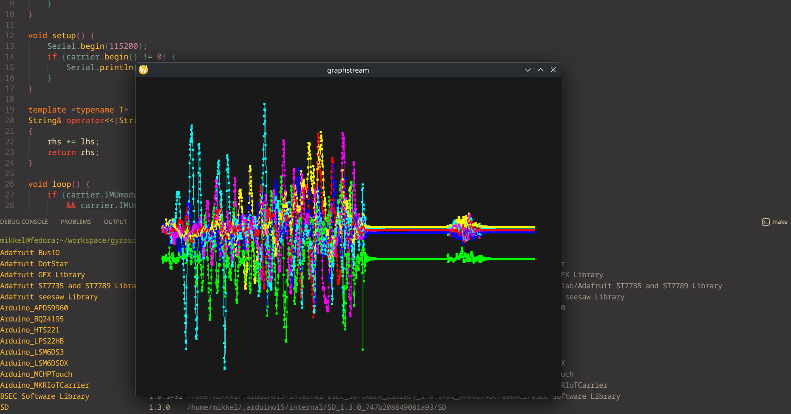
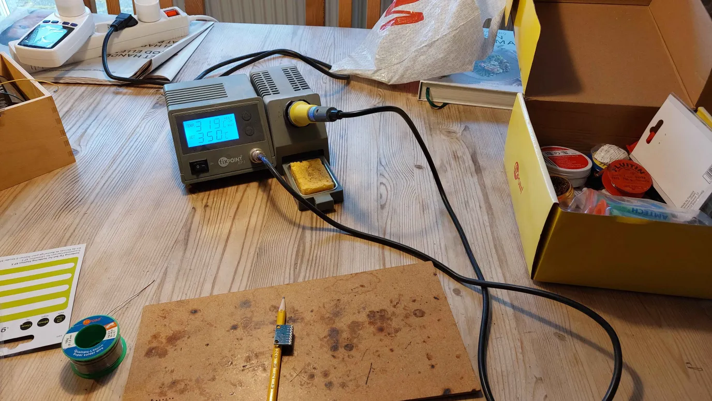
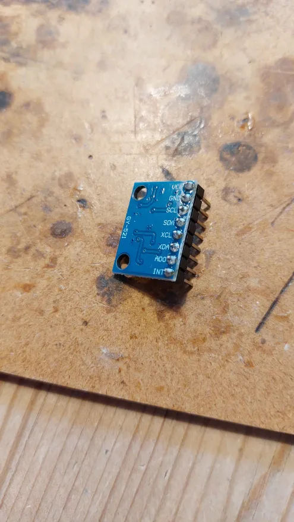
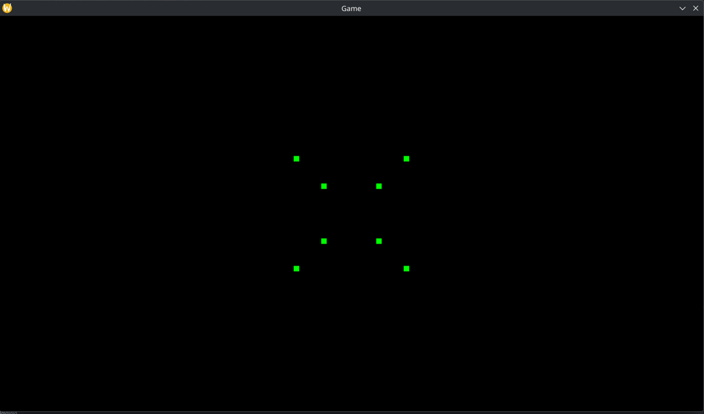
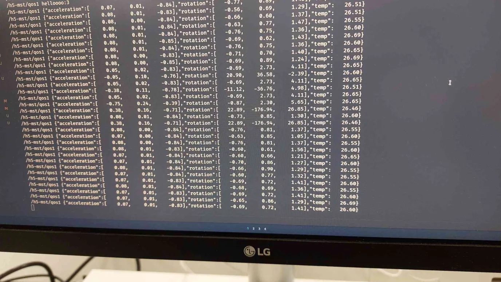
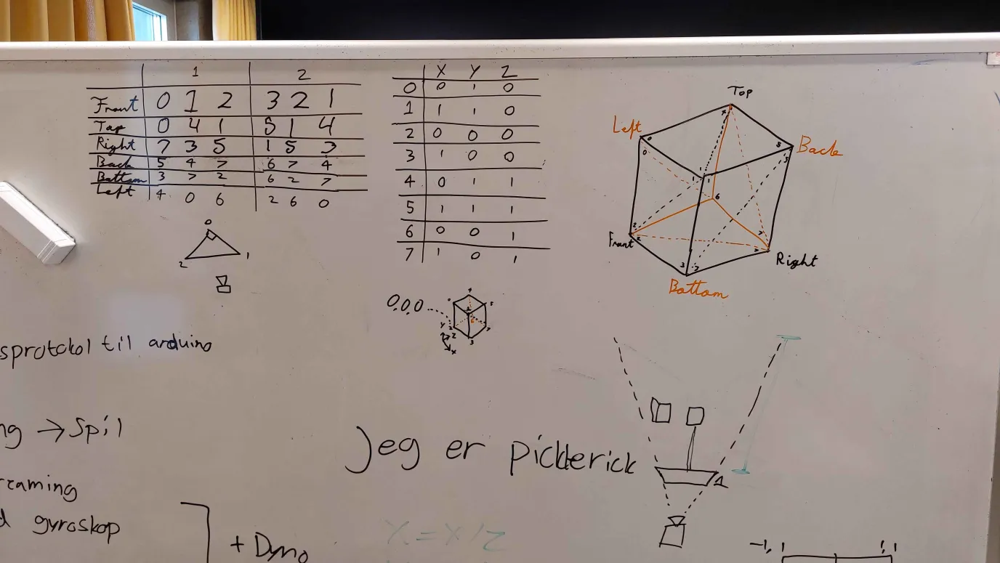
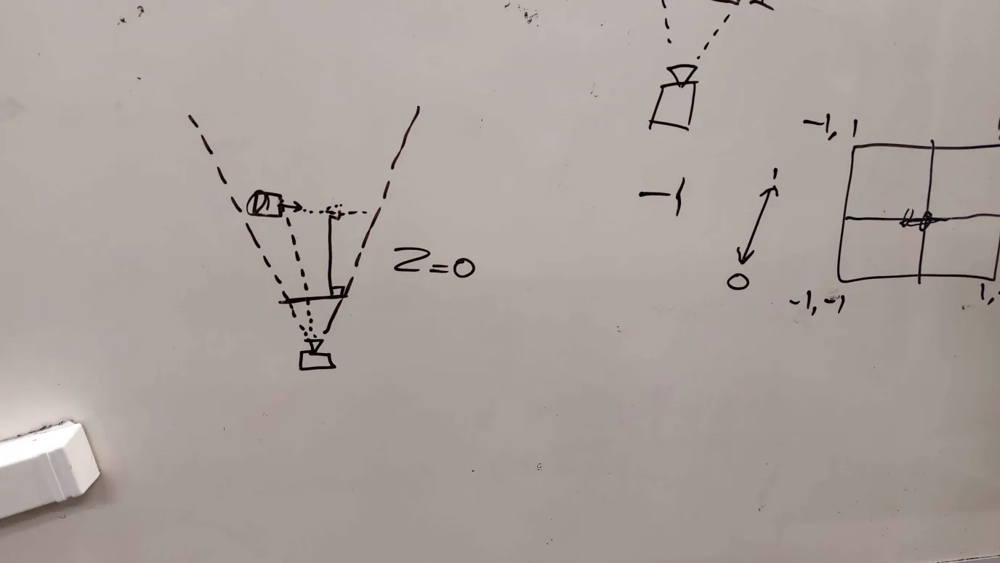
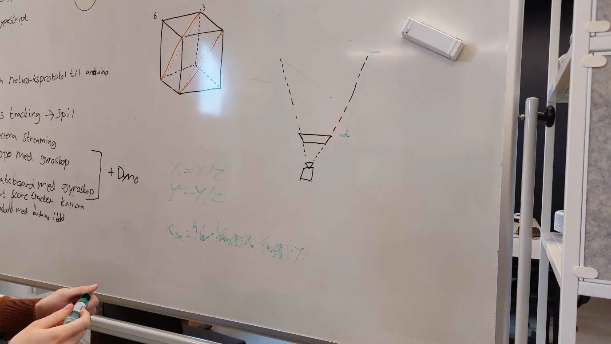
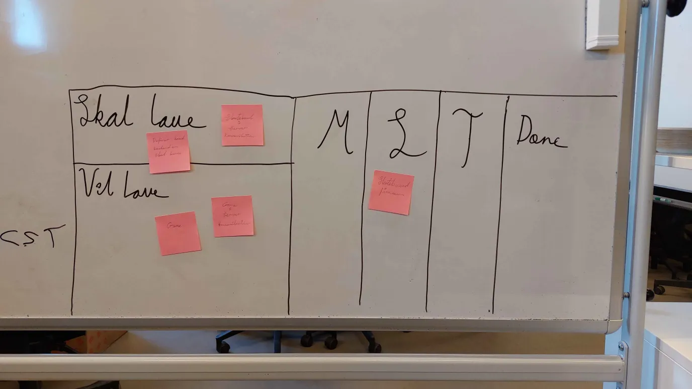

# Work log

## March 20

- Experimented with dart project and concluded that it would be difficult to get it to a state, where we would be satisfied.
- Decided to work on the skateboard gyroscope project.
- Proof of concept with Arduino MKR 1010 and accelerometer/gyroscope.
- Decided on hardware:
  - Looked at board, decided on an ESP32, specifically Arduino Nano ESP32 with an ESP32-S3.
  - Looked at MPU6050 accelerometer, as it is often used for Arduino and Raspberry Pi projects.
  - Bought the 2 components. Delivery due Monday.

## March 23
- Started on the creating the game.
- Created a format check and test setup for the backend.
- Created pipelines for building and testing our backend.
- Created custom image for backend pipeline with correct build tools installed.
- Added game to the pipeline.
- Begin settting up Linux HTTP server on backend.
- Hardware arrived.
- Soldered pins on the MPU6050.
- Wire setup on breadboard according to guide online.
- Installed ESP32 build tools.
- Created a "Hello World!" project on the ESP32.

Current subprojects:
- **Skateboard hardware:** Currently assembled on a breadboard. The setup seems to work. The ambition is to make a physical rig (a skateboard) to mount the circuit boards on. Nothing has been thought out in this regard, and this step is deferred.
- **Skateboard firmware:** Currently there's a hello world project. MPU6050 the driver has been imported, but not completely. The accel/gyro example doesn't compile yet, as the I2C-driver dependency is not set correctly. The short term ambition is to make a firmware that reads accel/gyro sensor data with the driver and prints it to serial. After that, the ambition is to add MQTT transmission. This requires an MQTT message broker to be set up. The long term low priority ambition is to write a custom MPU6050 driver.
- **Game:** Currently the program which opens an empty window. The ambition is to create a slope like game, preferably with 3d graphics. If the 3d graphics is too ambition, we will make a simple 2d game with top down view of the skateboard game.

## March 24
- Created code to get data from the accel/gyro sensors.
- Send the accel/gyro data from board to a backend over MQTT.
- Continued Work on the 3d rendering. Created points that if connected would look like a cube.
- Backend and game ci pipelines.

## March 25

- Backend can now receive data.
- Continued working on 3d rendering with no luck.

## March 26

- Got 3d rendering working.
- Refactored backend.

## March 27

- Created a planning board
- Added a scene to game which renders objects in the right order.

